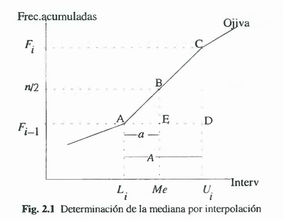

## Medida de tendencia central para datos agrupados

### Media: ($\bar{x}$)
$$\bar{x}=\frac{\sum_{i=1}^n f_ix_i}{\sum_{i=1}^n f_i}$$

$$\bar{x}=\frac{1}{n}\cdot\sum_{i=1}^n f_ix_i$$

>Donde ($x_i$):
$$x_i=\frac{L_i+L_{i+1}}{2}$$

Consideremos la siguiente tabla de distribucion de frecuencia

| $I_i$ | $x_i$ | $f_i$ | $F_i$ |
|:-----:|:-----:|:-----:|:-----:|
|[1 - 5)|3      |4      |4      |
|[5 - 9)|7      |7      |11     |
|[9 -13)|11     |10     |21     |
|[13-17]|15     |2      |23     |
|TOTAL  |       |23     |       |

Calculamos la media ponderada de la siguiente manera:

$$\bar{x}=\frac{1}{23}\cdot(3(4)+7(7)+11(10)+15(2))$$

$$\bar{x}=8.73$$

### Mediana ($me$):

$$me= L_i + \frac{A}{f_i} \left(\frac{n}{2}-F_{i-1} \right)$$

### Moda ($mo$):
$$mo= L_i + A \left(\frac{d_1}{d_1 + d_2}\right)$$

