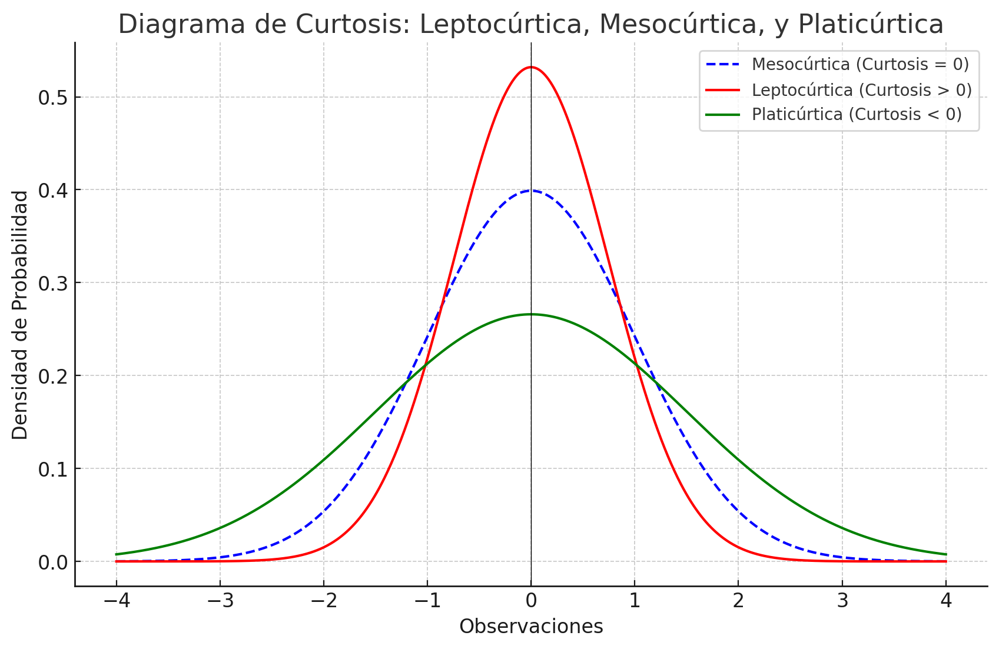
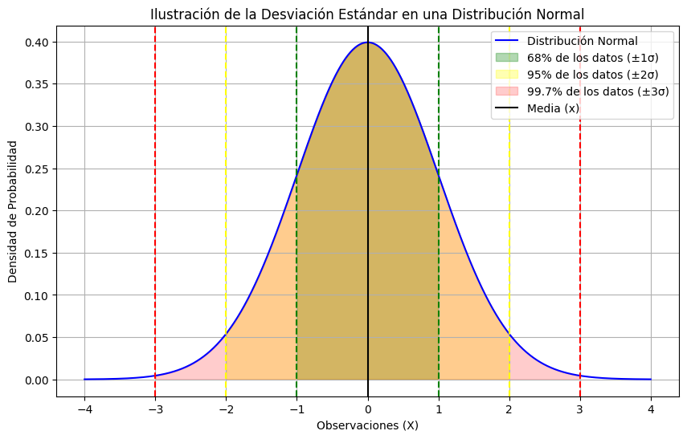

## Medidas de tendencia central

Media = $\bar{x}$

$$\bar{x}=\frac{x_1 + x_2 + x_3 + \cdots x_n}{n}$$

$$\bar{x}=\frac{\sum_{i=1}^n x_i}{n}$$

$$\bar{x}=\frac{1}{n}\cdot\sum_{i=1}^n x_i$$

**Ejemplo**
$$ x_1=1.71, x_2=1.59, x_3=1.71, x_4=1.64, x_5=1.64, \newline
x_6=1.70, x_7=1.60, x_8=1.69, x_9=1.53, x_{10}=1.54, \newline
x_{11}=1.65, x_{12}=1.68, x_{13}=1.69, x_{14}=1.57, x_{15}=1.64, \newline
x_{16}=1.58, x_{17}=1.65, x_{18}=1.60, x_{19}=1.50, x_{20}=1.64, \newline
x_{21}=1.50, x_{22}=1.70$$

$$\bar{x}=\frac{1.71 + 1.59 + 1.71 + \dots +  1.70}{22}$$

$$\bar{x}=\frac{35.75}{22}=1.625$$

## Estadisticos

|   | Varianza | Media | Desv Estandar |
|---|----------|-------|---------------|
|Poblacion|$\sigma^2$|$\mu$|$\sigma$   |
|Muestra|$S^2=\sigma_{\bar{x}}^2$|$\bar{x}$|$s=\sigma_{\bar{x}}$|

### Varianza muestral
$$S^2=\frac{1}{n-1}\cdot\sum_{i=1}^n (x_i-\bar{x})^2$$

**Ampliación**
Aplicar binomio cuadrado: $(a-b)^2=a^2+b^2-2ab$

$$S^2=\frac{1}{n-1}\cdot\sum_{i=1}^n (x_i^2+\bar{x}^2-2\cdot x_i\cdot \bar{x})$$

$$S^2=\frac{1}{n-1} \left(\sum_{i=1}^n x_i^2+\sum_{i=1}^n\bar{x}^2-\sum_{i=1}^n2\cdot x_i\cdot \bar{x} \right)$$

$$S^2=\frac{1}{n-1} \left(\sum_{i=1}^n x_i^2+n\bar{x}^2-2\cdot \frac{n}{n} \cdot\sum_{i=1}^n x_i\cdot \bar{x} \right)$$

$$S^2=\frac{1}{n-1} \left(\sum_{i=1}^n x_i^2+n\bar{x}^2-2 n \bar{x}^2 \right)$$

$$S^2=\frac{1}{n-1} \left(\sum_{i=1}^n x_i^2 - n\bar{x}^2\right)$$

Ejemplo aplicativo de varianza

Con la formula original:

$S^2=\frac{1}{22-1}\cdot((1.71-1.625)^2 + (1.59-1.625)^2 + (1.71-1.625)^2 + (1.64-1.625)^2 + (1.64-1.625)^2 + (1.70-1.625)^2 + (1.60-1.625)^2 + (1.69-1.625)^2 + (1.53-1.625)^2 + (1.54-1.625)^2 + (1.65-1.625)^2 + (1.68-1.625)^2 + (1.69-1.625)^2 + (1.57-1.625)^2 + (1.64-1.625)^2 + (1.58-1.625)^2 + (1.65-1.625)^2 + (1.60-1.625)^2 + (1.50-1.625)^2 + (1.64-1.625)^2 + (1.50-1.625)^2 + (1.70-1.625)^2)$

$$S^2=\frac{0.09435}{21} $$

Con la formula derivada:

$S^2=\frac{1}{22-1}(( 1.71^2 + 1.59^2 + 1.71^2 + 1.64^2 + 1.64^2 + 1.70^2 + 1.60^2 + 1.69^2 + 1.53^2 + 1.54^2 + 1.65^2 + 1.68^2 + 1.69^2 + 1.57^2 + 1.64^2 + 1.58^2 + 1.65^2 + 1.60^2 + 1.50^2 + 1.64^2 + 1.50^2 + 1.70^2 )-22(1.625)^2 )$

$$S^2=\frac{1}{21}((58.1881)-22(1.625)^2 )$$

$$S^2=\frac{1}{21}(58.1881-58.09375)$$

$$S^2=\frac{0.09435}{21}$$

$$S^2=0.004492857142857143$$

### Desviación estandar

$$s = \sqrt{\frac{\sum_{i=1}^{n} (x_i - \bar{x})^2}{n - 1}}$$

$$s = \sqrt{0.004}$$

$$s = 0.06702877846758915$$

### Curtosis

: La curtosis es una medida de la forma de la distribución de una variable aleatoria.

### Mediana
### Moda

